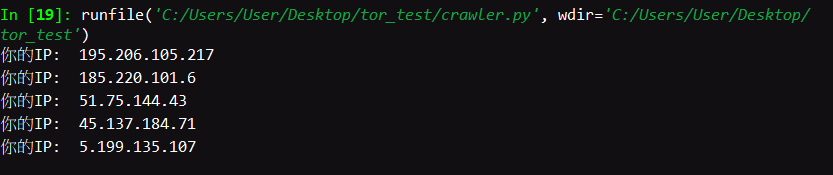

# Tor_IP_Jumper
Use onion routing to change IP dynamically.

## Demo

## Declaration
* This project is **only for education purpose**.

## Reference
* [[ Selenium ] 偽造身份進行網路爬蟲
4月 17, 2018](https://hardliver.blogspot.com/2018/04/selenium.html)
* [Python 執行 dos 下面的命令](http://wiki.alarmchang.com/index.php?title=Python_%E5%9F%B7%E8%A1%8C_dos_%E4%B8%8B%E9%9D%A2%E7%9A%84%E5%91%BD%E4%BB%A4%EF%BC%8C%E4%B8%8D%E7%AD%89%E5%BE%85%E8%A9%B2%E5%91%BD%E4%BB%A4%E7%B5%90%E6%9D%9F(NoWait)_%E5%B0%B1%E7%9B%B4%E6%8E%A5%E5%BE%80%E4%B8%8B%E7%B9%BC%E7%BA%8C%E5%9F%B7%E8%A1%8C)
